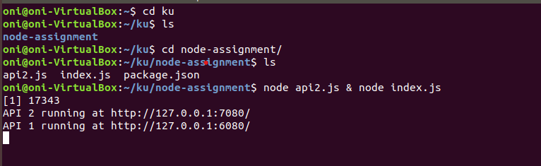

# NodeJs

### Step 1: Install Nodejs latest LTS version

```bash
curl -fsSL https://deb.nodesource.com/setup_16.x | sudo -E bash -
sudo apt-get install -y nodejs
```

### Step 2: Create two APIs

2.1 Initiate a nodejs application using `npm init`

2.2 Supply the required details for `package.json`

2.3 Create a file `index.js` and have the code inside it listen on two different ports simulating two different APIs

In file  `index.js`

```jsx
const http = require('http');

const hostname = '127.0.0.1';
const api2_port=7080;

const server1 = http.createServer((req, res) => {
  res.statusCode = 200;
  res.setHeader('Content-Type', 'text/plain');
  res.end('Hello Node Js');
});

server1.listen(api1_port, hostname, () => {
  console.log(`API 1 running at http://${hostname}:${api1_port}/`);
});

```

In file api2.js

```jsx

const http = require('http');

const hostname = '127.0.0.1';
const api2_port=7080;

const server2 = http.createServer((req, res) => {
  res.statusCode = 200;
  res.setHeader('Content-Type', 'text/plain');
  res.end('Node Js Installed Successfully');
});

server2.listen(api2_port, hostname, () => {
  console.log(`API 2 running at http://${hostname}:${api2_port}/`);
});
```

### Step 3: Run those files using

```jsx
node index.js & api2.js
```



API 1 Endpoint


API 2 Endpoint


### Step 4: Install pm2 tool globally

```bash
npm install pm2 -g
```

### Step 5: Start 4/4 instances of both API using pm2

```bash
pm2 start api2.js index.js -i 4
```


### Step 6: Stop all instance one by one

```bash
pm2 stop {0..7}
```


### Findings

- learnt about node js runtime
- learnt that `pm2` is production process manager for nodejs applications
- you can use linux backgrounding or `npm` `concurrently` package for running two apis simultaneoulsy.