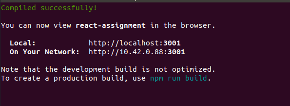

# ReactJs

### Step 1: Install ReactJs

Since we will be using it for creating a Single Page Application we use `Create React App` tool for initiating the project.

```bash
npx create-react-app react-assignment
cd react-assigment
npm start
```

### Step 2: Change the default port to 3001

Inside the project directory create an `.env` file for storing the `PORT` environment variable and assign it the port you want you application to run on.

```bash
echo "PORT=3001" > .env
```

You can also assign other environments variables using this same file.




### Step 3: Change the content from `App.js` inside of the `src` folder

You can edit the file to make changes and they page will reload automatically.

We changed the content inside of the div to "Hello from React.js"

 


### Findings:

- react.js is a frontend library for building reactive UI from facebook
- create-react-app utility is used for quick bootstrapping of a react project